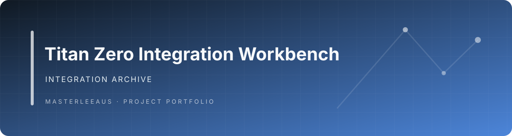

# Titan Zero Integration Archive

**A staging repository for assembling Titan Zero components and integration work.**

> **Status: integration snapshot.** The repository currently contains only this README on its default branch. It is not the active Titan Zero product implementation.

## Relationship to the active platform

The current field-service product is maintained in [Titan Zero Field Service Workforce](https://github.com/Masterleeaus/Titan-Zero-Field-Service-Workforce). Separate supporting projects are maintained in their own repositories, including the [Interaction Engine](https://github.com/Masterleeaus/Interaction-engine), [WorkCore Extensions](https://github.com/Masterleeaus/workcore-extensions), [AI Extensions](https://github.com/Masterleeaus/Ai-extensions), and [Titan Themes](https://github.com/Masterleeaus/Titan-themes).

This repository should only be used for an integration when its branch, source inputs, expected outputs, and promotion path are documented. Avoid treating it as a second product source of truth.

## Repository status

- Default branch: `main`
- Current checked-in content: this README
- Build and test commands: none available on the default branch
- Release status: no release artifact verified

## Banner

A project-specific graphic has not yet been added. The centered title serves as the landing header until an accurate visual asset is available.
